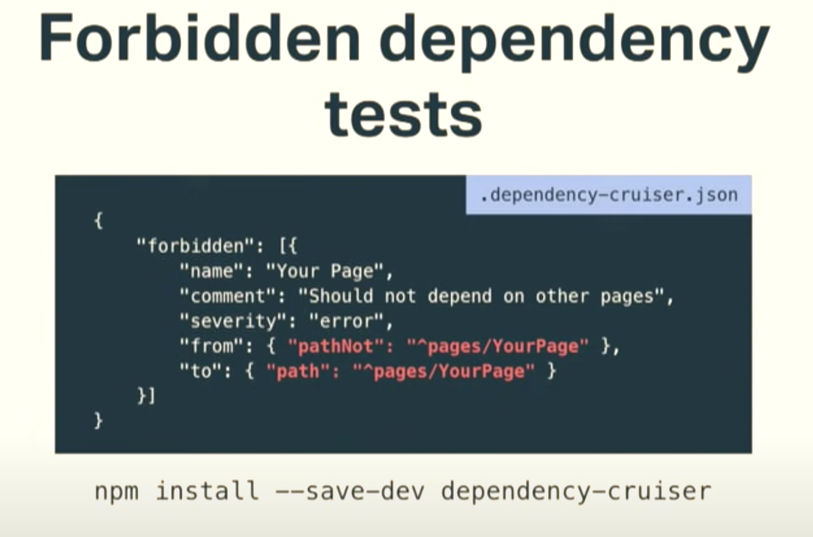

# Frontend: 架构 Architecture

## Memo

### 将架构视作制定约束

Architecture as enabling constraints.

约束我们如何使用数据和代码帮助我们提升生产效率。

> Eg: 路上开车时，交通规则和约定作为大家遵守的交通规则“架构”，信号灯、转向灯，有时还有物理屏障，这些设置和约定的目的在于帮助我们高效且安全的前往目的地。这其实与软件开发非常相似。
>
> 比如 [[object-oriented-programing|OOP]]，很多语言可以非常灵活自由的组织代码，但是在 OOP 范式中，我们要遵从约束，放弃语言提供的部分灵活性，将代码组织为一个个独立的 class，而遵从 OOP 将带来完善的封装性、低耦合的代码结构等好处。
>
> 比如 [[functional-programing|面向过程编程]]，前端更加熟悉的开发方式，在面向过程编程时比较重要的一点是 immutability，也就是不变性（指的是不修改入参、共享数据等）。虽然直接修改入参、全局或局部的共享数据非常灵活和方便，但是会造成竟态条件、并发问题等不利影响，遵从不变性可以消除这些影响。

### 架构调整目的：消除“大泥球”式的混乱依赖关系（big ball of mud）

修复目标：依赖关系混乱导致任何修改无法定位影响范围，无法确定那些部分需要进行回归测试。

修复方式：制定单向分层的依赖关系约束，这样任何修改都能定位到最下游的依赖，可以明确回归测试范围。

### 编码方式约束：低耦合 > 复用、抽象

代码复用和抽象的一个目的在于减少 bug，越少代码越少 bug。但是如果频繁复用也会导致代码紧耦合，体现在互不关联的不同组件被依赖，想象一下业务需求发生变更时这个组件会发生什么？会增加数不清的分支条件来让其可以被不同的场景使用。

约束编码方式，低耦合优先于代码复用，任何时候一个抽象出来的组件随业务需求变化不再符合最初将其抽象出来的目的时，需要将其从原本的组件抽离出来。这样可以降低耦合的程度，并且新的业务需求不会影响到原本的组件。只要旧的业务需求依旧存在，这些组件可以共存。

### 强制边界：forbidden dependencies tests

架构约束可能会造成代码复用不够彻底，尤其是架构上约束了依赖方向时，某些目录下的代码不能依赖另一些代码，这种约束的目的在于降低代码之间的耦合程度，但是的确会造成在使用相同逻辑时，这些重复的代码无法复用。问题在于这种约束仅仅是规范，没有强制执行的措施的话，一旦有新成员加入团队，在不理解架构约束的目的时可能会给代码带来紧密耦合。这时考虑使用 CI 工具来自动检测依赖关系，并且定义规则禁止某些目录依赖另一些目录的文件，来强制执行架构约束，保证边界不被侵犯。

```js
npm install --save-dev dependency-cruiser
```



### takeaways

- 加入新功能、写一个新函数、建一个新模块，这些都是架构上的判断和决定
- 架构在软件开发层面是共通的，前端架构不必拘束于 Vue 或者 React 框架的最佳实践，甚至不必拘束于 JavaScript 的架构思维，比如 MVC 架构，兴起于 Java 等静态语言，最终发展到软件开发的各个领域

### 前端架构模式

- Flux，由 facebook 提出用于构建 SPA 的模式。Flux 建议将应用拆分为 Stores（数据中心）、Dispatcher（调度器）、Views（UI）和 Actions（业务逻辑）。

## 参考

- 【Video】[Building Resilient Frontend Architecture • Monica Lent • GOTO 2019 - YouTube](https://www.youtube.com/watch?v=TqfbAXCCVwE)
